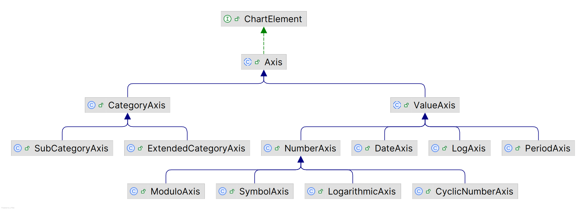

# 坐标轴

## 简介

坐标轴的类图如下，主要分为：

- 数值坐标轴：`ValueAxis`
  - `PeriodAxis`，基于 `RegularTimePeriod` 显示日期的坐标轴
  - `ModuloAxis`，使用模数计算显示固定范围数值的轴
- 分类坐标轴：`CategoryAxis`



## ValueAxis

- `standardTickUnits`

标轴刻度单位。设置方法：

```java
rangeAxis.setStandardTickUnits(NumberAxis.createIntegerTickUnits());
```


### NumberAxis

