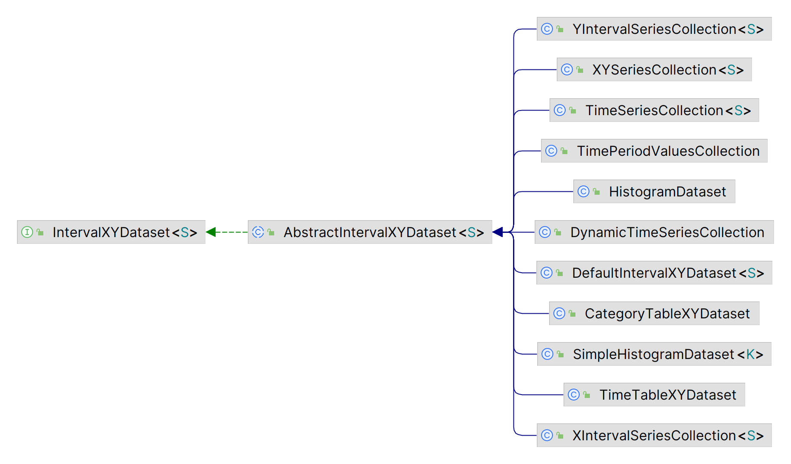

# org.jfree.data.xy

## 简介

包含 `XYDataset` 接口，扩展和实现类。为 `XYPlot` 对应 `XYItemRenderer` 提供数据。、

## IntervalXYDataset

常用实现：

- `DefaultIntervalXYDataset`
- `XYIntervalSeriesCollection`

专用实现：

- `HistogramDataset`
- `SimpleHistogramDataset`
- `TimePeriodValuesCollection`
- `TimeSeriesCollection`
- `TimeTableXYDataset`
- `XYBarDataset`

