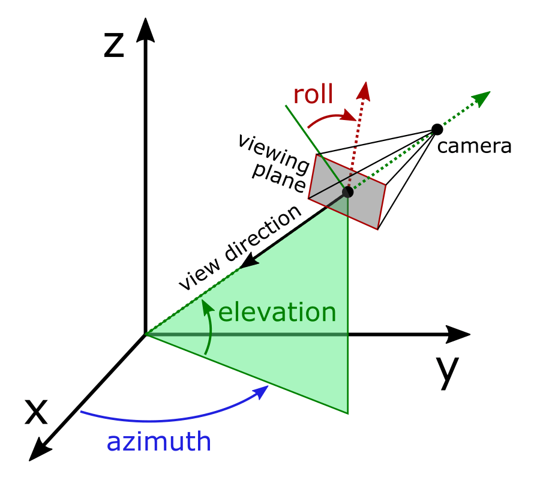

# chart3d

## 简介

Orson Charts 用于生成三维 chart。主要功能：

1. 多种图表类型：pie chart, bar chart (常规和 stacked), line chart, area chart, scatter plot 以及 surface charts；
2. 内置轻量级 3D 渲染引擎，无需额外依赖，易于部署；
3. 支持鼠标查看 charts 组件（包括 JavaFX 和 Swing），提供 360 度旋转和缩放功能，为用户提供精确的视图控制；
4. 自适应坐标轴标签；
5. 支持将 chart 导出为 PDF 和 SVG；
6. 完善的 API，chart 高度可定制。

## 入门

使用 Orson Charts，首先添加 `org.jfree.chart3d` 依赖项，然后准备数据。Orson Charts 数据集有三个主要接口，用于饼图的 `PieDataset3D`, 用于条形图和其它基于类别 chart 的 `CategoryDataset3D`，以及一个用于数值数据的 `XYZDataset`。库中包含这些接口的标准实现，可以轻松创建数据集。以饼图为例：

```java
StandardPieDataset3D dataset = new StandardPieDataset3D();
dataset.add("Milk Products", 625);
dataset.add("Meat", 114);
```

准备好数据集，就可以创建 chart 对象。这里可以使用 `Chart3DFactory` 类：

```java
Chart3D chart = Chart3DFactory.createPieChart("Title", "Subtitle", dataset);
```

最后，如果是开发 Swing 应用，则需要将 chart 放在 UI 中的某个位置。这里可以使用 `Chart3DPanel`：

```java
Chart3DPanel chartPanel = new Chart3DPanel(chart);
```

## 视角

在三维图中，视角的位置 由三个角度定义：仰角（elevation）、方位角（azimuth）和滚动角（roll）。从最终位置来看，它始终指向绘图框体积的中心。roll-angle 为正使试图平面顺时针旋转，因此 3D 轴看起来会逆时针旋转。如下图：




## 数据集

### PieDataset3D

### CatetgoryDataset3D

多个系列 `(rowKey, columnKey, value)` 形式的数据。定义如下：

```java
public interface CategoryDataset3D<S extends Comparable<S>, 
        R extends Comparable<R>, C extends Comparable<C>> 
        extends KeyedValues3D<S, R, C, Number>, Dataset3D {
}
```

- `S`，series key 类型，必须实现 `Comparable`
- `R`, row key 类型，必须实现 `Comparable`
- `C`，column key 类型，必须实现 `Comparable`


### XYZDataset


## XYZLineChart

1. 创建数据集

```java
public static XYZDataset<String> createDataset() {
    XYZSeriesCollection<String> dataset = new XYZSeriesCollection<>();
    for (int s = 1; s < 24; s++) {
        XYZSeries<String> series = new XYZSeries<>("Series " + s);
        double y = 1.0;
        for (int i = 0; i < 3000; i++) {
            y = y * (1.0 + (Math.random() - 0.499) / 10.0);
            series.add(i, y, s); // 每个点包含三个值，对应 (x,y,z)，每个 series 的 z 相同
        }
        dataset.add(series);
    }

    return dataset;
}
```

2. 使用数据集创建 chart

```java
private static Chart3D createChart(XYZDataset dataset) {
    Chart3D chart = Chart3DFactory.createXYZLineChart("XYZ Line Chart Demo",
            "Orson Charts", dataset, "Day", "Index", "Station");
    chart.setChartBoxColor(new Color(255, 255, 255, 128));
    XYZPlot plot = (XYZPlot) chart.getPlot();
    plot.setDimensions(new Dimension3D(15, 3, 8));
    NumberAxis3D zAxis = (NumberAxis3D) plot.getZAxis();
    zAxis.setTickSelector(new IntegerTickSelector());
    return chart;
}
```

3. 将 chart 放入 `Chart3DPanel`

`Chart3DPanel` 用于在 Swing 应用中显示 `Chart3D`。该面板注册事件通知，会自动出发 `Chart3D` 重绘。

`Chart3DPanel` 仅用于显示 chart，不包含其它功能，如试图工具栏和弹出菜单，这些功能由 `DisplayPanel3D` 提供。

```java
XYZDataset dataset = createDataset();
Chart3D chart = createChart(dataset);
Chart3DPanel chartPanel = new Chart3DPanel(chart);
```

4. 将 `Chart3DPanel` 放入 `DisplayPanel3D` 以提供工具栏和弹出菜单

```java
new DisplayPanel3D(chartPanel)
```

[完整代码](../../src/main/java/note/jfreechart/chart3d/XYZLineChart3DDemo1.java)。

## 自定义

### 设置尺寸

通过 `XYZPlot` 设置三个维度的比例，例如：

```java
plot.setDimensions(new Dimension3D(2, 1.5, 1.5));
```


## 参考

- https://matplotlib.org/stable/api/toolkits/mplot3d/view_angles.html