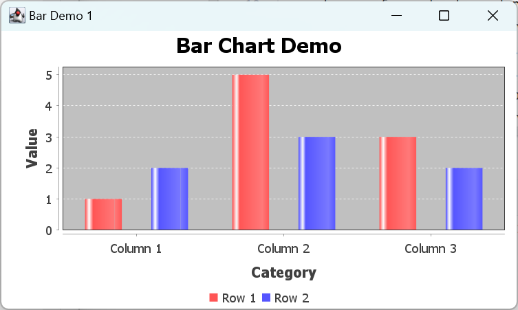
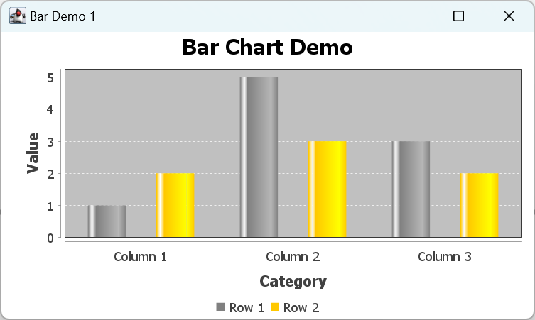
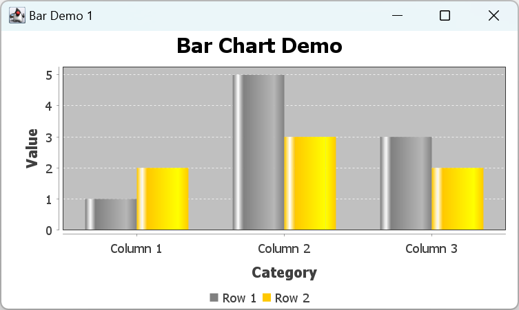

# 柱状图

- [柱状图](#柱状图)
  - [简介](#简介)
    - [创建 Dataset](#创建-dataset)
    - [创建柱状图](#创建柱状图)
  - [ChartFactory](#chartfactory)
  - [个性化](#个性化)
  - [自定义 Renderer](#自定义-renderer)
    - [Bar 颜色](#bar-颜色)
    - [Bar Spacing](#bar-spacing)

2023-12-26, 10:17⭐

****

## 简介

以如下数据为例：

||Column 1|Column 2|Column 3|
|---|---|---|---|
|Row 1|1.0|5.0|3.0|
|Row 2|2.0|3.0|2.0|

在 JFreeChart 中，表格称为数据集，column 标题称为 *category*，row 称为 *series*。

JFreeChart 将来自每一列（column，对应类别）的数据分组在一起，并使用颜色突出显示不同列的数据。

### 创建 Dataset

创建柱状图的第一步是创建数据集：

- `CategoryDataset` 接口定义柱状图数据
- `DefaultCategoryDataset` 提供默认数据

定义表格数据对应的数据集：

```java
DefaultCategoryDataset<String, String> dataset = new DefaultCategoryDataset<>();
dataset.addValue(1.0, "Row 1", "Column 1");
dataset.addValue(5.0, "Row 1", "Column 2");
dataset.addValue(3.0, "Row 1", "Column 3");
dataset.addValue(2.0, "Row 2", "Column 1");
dataset.addValue(3.0, "Row 2", "Column 2");
dataset.addValue(2.0, "Row 2", "Column 3");
```

### 创建柱状图

```java
JFreeChart chart = ChartFactory.createBarChart(
        "Bar Chart Demo", // 标题
        "Category", // X 轴
        "Value", // y 轴
        dataset, // 数据
        PlotOrientation.VERTICAL, // 方向
        true, // legend
        true, // tooltip
        false // url
);
```

- 条形图的方向 `PlotOrientation` 有水平和垂直两个方向
- tooltip 控制是否显示提示文本
- url，仅在用 HTML 图像 maps 创建报告时使用

[完整代码](../../src/main/java/note/jfreechart/bar/BarChartDemo.java)。效果如下：



## ChartFactory

下面看看 `ChartFactory.createBarChart()` 方法的源码：

```java
CategoryAxis categoryAxis = new CategoryAxis(categoryAxisLabel);
ValueAxis valueAxis = new NumberAxis(valueAxisLabel);
BarRenderer renderer = new BarRenderer();
...

CategoryPlot plot = new CategoryPlot(dataset, categoryAxis, valueAxis, renderer);
plot.setOrientation(orientation);
JFreeChart chart = new JFreeChart(title, JFreeChart.DEFAULT_TITLE_FONT, plot, legend);
```

说明：

- 柱状图有两个轴，一个显示数据集类别（`CategoryAxis`），另一个显示数据（`NumberAxis`）
- `BarRenderer` 用于绘制 bar，renderer 处理大部分的绘图工作。
- `dataset`, `axes` 和 `renderer` 一起由 `CategoryPlot` 管理，它协调这些组件之间的交互。在自定义图表时，通常需要获得 plot 引用，从而可以继续访问 axes, renderer 和 dataset
- 最后，将 plot 包装到 `JFreeChart` 实例中，并指定标题

## 个性化

通过调用 `JFreeChart` 和 `CategoryPlot` 的方法，可以实现简单的定制。例如，

- 修改背景颜色

```java
chart.setBackgroundPaint(Color.white); // 背景色
CategoryPlot plot = (CategoryPlot) chart.getPlot();
plot.setBackgroundPaint(Color.lightGray); // plot 的背景色
plot.setRangeGridlinePaint(Color.white); // plot 的网格线颜色
```

这里需要将 `Plot` 强制转换为 `CategoryPlot`，因为知道柱状图是该类型，所以该转换不会出错。

## 自定义 Renderer

对柱状图，其 renderer 类型为 `BarRenderer`。从 `CategoryPlot` 获取该 renderer 后，可以修改很多选项。

### Bar 颜色

修改每个 Series 的颜色：

```java
BarRenderer renderer = (BarRenderer) plot.getRenderer();
renderer.setSeriesPaint(0, Color.GRAY);
renderer.setSeriesPaint(1, Color.ORANGE);
renderer.setDrawBarOutline(false);
```



### Bar Spacing

renderer 通过 `itemMargin` 属性设置不同 category 的 bar 之间的间距。删除间距：

```java
renderer.setItemMargin(0.0);
```


