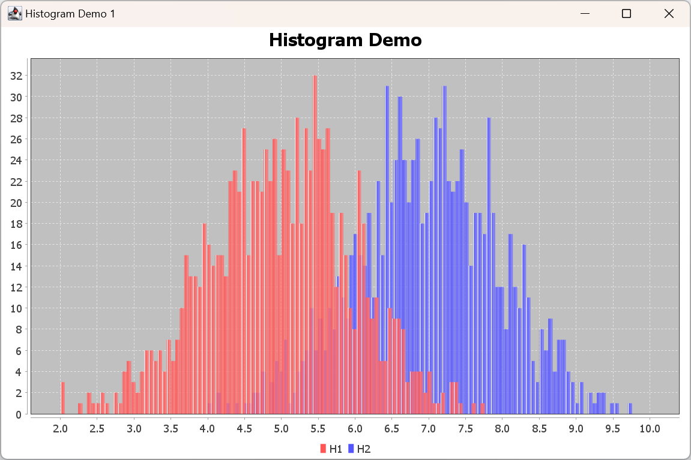
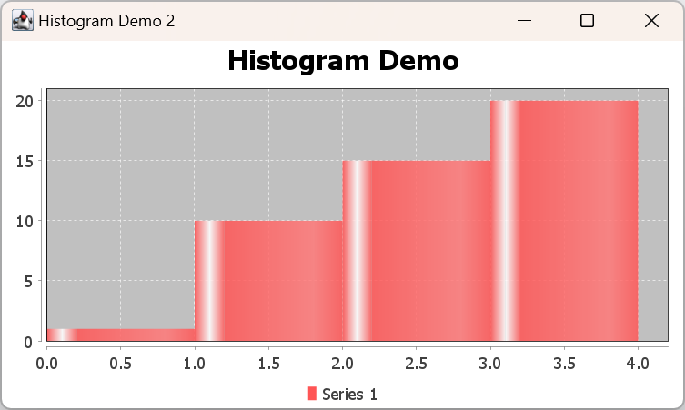

# 直方图

2024-04-29✔️
***

- 直方图简单示例

```java
import org.jfree.chart.ChartFactory;
import org.jfree.chart.JFreeChart;
import org.jfree.chart.plot.PlotOrientation;
import org.jfree.chart.plot.XYPlot;
import org.jfree.chart.renderer.xy.XYBarRenderer;
import org.jfree.chart.swing.ApplicationFrame;
import org.jfree.chart.swing.ChartPanel;
import org.jfree.chart.swing.UIUtils;
import org.jfree.data.statistics.HistogramDataset;
import org.jfree.data.xy.IntervalXYDataset;

import javax.swing.*;
import java.util.Random;

public class HistogramDemo1 extends ApplicationFrame {

    public HistogramDemo1(String title) {
        super(title);
        JPanel chartPanel = createDemoPanel();
        chartPanel.setPreferredSize(new java.awt.Dimension(500, 270));
        setContentPane(chartPanel);
    }

    private static IntervalXYDataset createDataset() {
        HistogramDataset dataset = new HistogramDataset();
        double[] values = new double[1000];
        Random random = new Random(12345678L);
        for (int i = 0; i < 1000; i++) {
            values[i] = random.nextGaussian() + 5;
        }
        // 参数：bins=100,bin-lower-bound=2.0,bin-upper-bound=8
        dataset.addSeries("H1", values, 100, 2.0, 8.0);

        values = new double[1000];
        for (int i = 0; i < 1000; i++) {
            values[i] = random.nextGaussian() + 7;
        }
        dataset.addSeries("H2", values, 100, 4.0, 10.0);
        return dataset;
    }

    private static JFreeChart createChart(IntervalXYDataset dataset) {
        JFreeChart chart = ChartFactory.createHistogram(
                "Histogram Demo",
                null,
                null,
                dataset,
                PlotOrientation.VERTICAL,
                true,
                true,
                false
        );
        XYPlot plot = (XYPlot) chart.getPlot();
        plot.setForegroundAlpha(0.85f);
        XYBarRenderer renderer = (XYBarRenderer) plot.getRenderer();
        renderer.setDrawBarOutline(false);
        return chart;
    }

    public static JPanel createDemoPanel() {
        JFreeChart chart = createChart(createDataset());
        return new ChartPanel(chart);
    }

    public static void main(String[] args) {
        HistogramDemo1 demo = new HistogramDemo1("Histogram Demo 1");
        demo.pack();
        UIUtils.centerFrameOnScreen(demo);
        demo.setVisible(true);
    }
}
```



- 手动设置 bin

```java
import org.jfree.chart.ChartFactory;
import org.jfree.chart.JFreeChart;
import org.jfree.chart.plot.PlotOrientation;
import org.jfree.chart.plot.XYPlot;
import org.jfree.chart.renderer.xy.XYBarRenderer;
import org.jfree.chart.swing.ApplicationFrame;
import org.jfree.chart.swing.ChartPanel;
import org.jfree.chart.swing.UIUtils;
import org.jfree.data.statistics.SimpleHistogramBin;
import org.jfree.data.statistics.SimpleHistogramDataset;
import org.jfree.data.xy.IntervalXYDataset;

import javax.swing.*;

public class HistogramDemo2 extends ApplicationFrame {

    public HistogramDemo2(String title) {
        super(title);
        JPanel chartPanel = createDemoPanel();
        chartPanel.setPreferredSize(new java.awt.Dimension(500, 270));
        setContentPane(chartPanel);
    }

    private static IntervalXYDataset createDataset() {
        SimpleHistogramDataset dataset = new SimpleHistogramDataset("Series 1");
        // 参数：bin-lower-bound,bin-upper-bound,include-lower-bound,include-upper-bound
        SimpleHistogramBin bin1 = new SimpleHistogramBin(0.0, 1.0, true, false);
        SimpleHistogramBin bin2 = new SimpleHistogramBin(1.0, 2.0, true, false);
        SimpleHistogramBin bin3 = new SimpleHistogramBin(2.0, 3.0, true, false);
        SimpleHistogramBin bin4 = new SimpleHistogramBin(3.0, 4.0, true, true);
        // 设置 bin 的计数
        bin1.setItemCount(1);
        bin2.setItemCount(10);
        bin3.setItemCount(15);
        bin4.setItemCount(20);

        dataset.addBin(bin1);
        dataset.addBin(bin2);
        dataset.addBin(bin3);
        dataset.addBin(bin4);
        return dataset;
    }

    private static JFreeChart createChart(IntervalXYDataset dataset) {
        JFreeChart chart = ChartFactory.createHistogram(
                "Histogram Demo",
                null,
                null,
                dataset,
                PlotOrientation.VERTICAL,
                true,
                true,
                false
        );
        XYPlot plot = (XYPlot) chart.getPlot();
        plot.setForegroundAlpha(0.85f);
        XYBarRenderer renderer = (XYBarRenderer) plot.getRenderer();
        renderer.setDrawBarOutline(false);
        return chart;
    }
    
    public static JPanel createDemoPanel() {
        JFreeChart chart = createChart(createDataset());
        return new ChartPanel(chart);
    }

    public static void main(String[] args) {
        HistogramDemo2 demo = new HistogramDemo2("Histogram Demo 2");
        demo.pack();
        UIUtils.centerFrameOnScreen(demo);
        demo.setVisible(true);
    }
}
```

