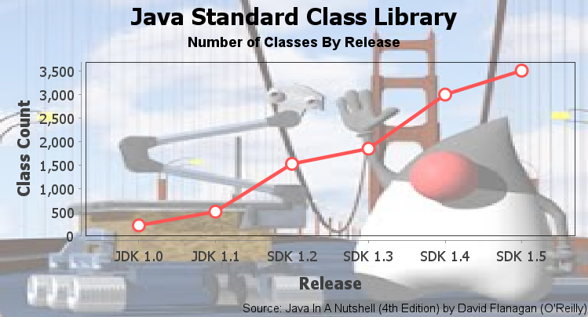
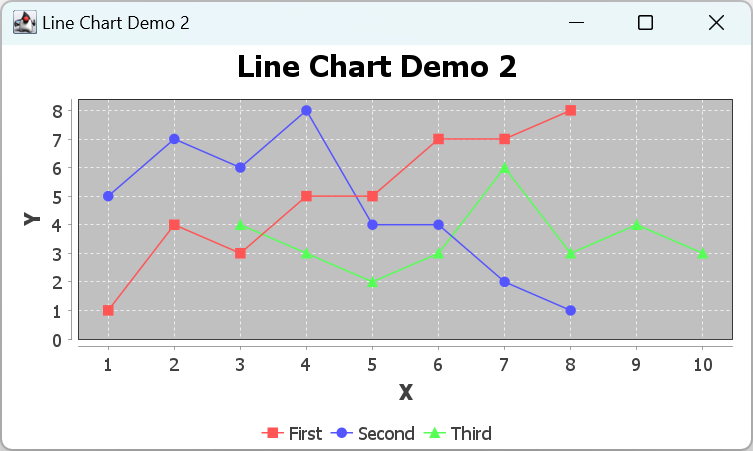
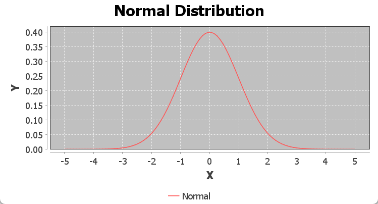

# 折线图

2025-01-15 添加函数图像
2023-12-26, 11:29⭐⭐
***

## 简介

  使用 `CategoryDataset` 和 `XYDataset` 都可以创建折线图。

## CategoryDataset 折线图

基于 `CategoryDataset` 的折线图直接用直线将数据 (category, value) 连起来。

### 数据集

创建图表的第一步，永远是准备数据，这里采用 `DefaultCategoryDataset`：

```java
DefaultCategoryDataset<String, String> dataset = new DefaultCategoryDataset<>();
dataset.addValue(212, "Classes", "JDK 1.0");
dataset.addValue(504, "Classes", "JDK 1.1");
dataset.addValue(1520, "Classes", "SDK 1.2");
dataset.addValue(1842, "Classes", "SDK 1.3");
dataset.addValue(2991, "Classes", "SDK 1.4");
```

### 创建 LineChart

使用 `ChartFactory` 的 `createLineChart()` 创建折线图：

```java
JFreeChart chart = ChartFactory.createLineChart(
    "Java Standard Class Library", // chart title
    "Release", // domain axis label
    "Class Count", // range axis label
    dataset, // data
    PlotOrientation.VERTICAL, // orientation
    false, // include legend
    true, // tooltips
    false // urls
);
```

### 自定义图表

下面实现如下自定义内容：

- 添加两个子标题
- chart 背景设为白色
- plot 背景设为 lightGray
- gridline 颜色设为 white
- range-axis 只显示整数值
- 修改 renderer 将 shapes 填充为白色
  

首先，在默认位置添加子标题（主标题下方）：

```java
chart.addSubtitle(new TextTitle("Number of Classes By Release"));
```

第二个子标题，放在底部，右对齐，并修改字体：

```java
TextTitle source = new TextTitle("Source: Java In A Nutshell (4th Edition) by David Flanagan (O'Reilly)");
source.setFont(new Font("SansSerif", Font.PLAIN, 10));
source.setPosition(RectangleEdge.BOTTOM);
source.setHorizontalAlignment(HorizontalAlignment.RIGHT);
chart.addSubtitle(source);
```

修改 chart 背景颜色：

```java
chart.setBackgroundPaint(Color.WHITE);
```

剩下的属性，需要先获得 `CategoryPlot` 对象引用才能继续修改：

```java
CategoryPlot<String, String> plot = (CategoryPlot) chart.getPlot();
```

设置 plot 背景颜色和 gridline 颜色：

```java
plot.setBackgroundPaint(Color.LIGHT_GRAY);
plot.setRangeGridlinePaint(Color.WHITE);
```

plot 负责绘制数据和坐标轴。其中一些工作委托给 renderer，可以通过 `getRenderer()` 获得 renderer 引用。与数据相关大部分工作由 renderer 处理：

```java
LineAndShapeRenderer renderer = (LineAndShapeRenderer) plot.getRenderer();
renderer.setDefaultShapesVisible(true);
renderer.setDrawOutlines(true);
renderer.setUseFillPaint(true);
```

修改坐标轴，只显示整数刻度：

```java
NumberAxis rangeAxis = (NumberAxis) plot.getRangeAxis();
rangeAxis.setStandardTickUnits(NumberAxis.createIntegerTickUnits());
```

[完整代码](../../src/main/java/note/jfreechart/line/LineChartDemo1.java)。效果：



## XYDataset 折线图

基于 `XYDataset` 的折线图用直线连接每个 (x,y) 点。下面创建下图所示折线图：



### 创建 XYDataset 数据集

这里可以使用任何实现 `XYDataset` 接口的数据集，我们使用 `XYSeriesCollection`：

```java
XYSeries<String> series1 = new XYSeries<>("First");
series1.add(1.0, 1.0);
series1.add(2.0, 4.0);
series1.add(3.0, 3.0);
series1.add(4.0, 5.0);
series1.add(5.0, 5.0);
series1.add(6.0, 7.0);
series1.add(7.0, 7.0);
series1.add(8.0, 8.0);

XYSeries<String> series2 = new XYSeries<>("Second");
series2.add(1.0, 5.0);
series2.add(2.0, 7.0);
series2.add(3.0, 6.0);
series2.add(4.0, 8.0);
series2.add(5.0, 4.0);
series2.add(6.0, 4.0);
series2.add(7.0, 2.0);
series2.add(8.0, 1.0);

XYSeries<String> series3 = new XYSeries<>("Third");
series3.add(3.0, 4.0);
series3.add(4.0, 3.0);
series3.add(5.0, 2.0);
series3.add(6.0, 3.0);
series3.add(7.0, 6.0);
series3.add(8.0, 3.0);
series3.add(9.0, 4.0);
series3.add(10.0, 3.0);

XYSeriesCollection<String> dataset = new XYSeriesCollection<>();
dataset.addSeries(series1);
dataset.addSeries(series2);
dataset.addSeries(series3);
```

每个 series 包含 x 和 y 值。这里 y 可以用 `null`，对 `null` 值不绘制连接线，从而导致不连续的折线。

### 创建 XYLineChart

```java
JFreeChart chart = ChartFactory.createXYLineChart(
    "Line Chart Demo 2", // chart title
    "X", // x axis label
    "Y", // y axis label
    dataset, // data
    PlotOrientation.VERTICAL,
    true, // include legend
    true, // tooltips
    false // urls
);
```

### 自定义 XYLineChart

修改如下属性：

- chart 背景色
- plot 背景色
- axis offsets
- domain 和 range 网格线
- 修改 renderer 同时绘制 shapes 和 lines
- 修改 range-axis，只显示整数刻度

chart 背景色：

```java
chart.setBackgroundPaint(Color.WHITE);
```

通过 plot 修改 plot 背景色，坐标轴，网格线：

```java
XYPlot<String> plot = (XYPlot) chart.getPlot();
plot.setBackgroundPaint(Color.LIGHT_GRAY);
plot.setAxisOffset(new RectangleInsets(5.0, 5.0, 5.0, 5.0));
plot.setDomainGridlinePaint(Color.WHITE);
plot.setRangeGridlinePaint(Color.WHITE);
```

通过 renderer 设置显示 shapes (默认只显示折线)：

```java
XYLineAndShapeRenderer renderer = (XYLineAndShapeRenderer) plot.getRenderer();
renderer.setDefaultShapesVisible(true);
renderer.setDefaultShapesFilled(true);
```

最后修饰坐标轴，只显示整数刻度：

```java
NumberAxis rangeAxis = (NumberAxis) plot.getRangeAxis();
rangeAxis.setStandardTickUnits(NumberAxis.createIntegerTickUnits());
```

### XYLineChart 完整代码

```java
import org.jfree.chart.ChartFactory;
import org.jfree.chart.JFreeChart;
import org.jfree.chart.api.RectangleInsets;
import org.jfree.chart.axis.NumberAxis;
import org.jfree.chart.plot.PlotOrientation;
import org.jfree.chart.plot.XYPlot;
import org.jfree.chart.renderer.xy.XYLineAndShapeRenderer;
import org.jfree.chart.swing.ApplicationFrame;
import org.jfree.chart.swing.ChartPanel;
import org.jfree.chart.swing.UIUtils;
import org.jfree.data.xy.XYDataset;
import org.jfree.data.xy.XYSeries;
import org.jfree.data.xy.XYSeriesCollection;

import java.awt.*;

public class LineChartDemo2 extends ApplicationFrame {

public LineChartDemo2(String title) {
    super(title);

    XYDataset<String> dataset = createDataset();
    JFreeChart chart = createChart(dataset);
    ChartPanel panel = new ChartPanel(chart);
    panel.setPreferredSize(new Dimension(500, 270));
    setContentPane(panel);
}

/**
    * @return a sample dataset.
    */
private static XYDataset<String> createDataset() {
    XYSeries<String> series1 = new XYSeries<>("First");
    series1.add(1.0, 1.0);
    series1.add(2.0, 4.0);
    series1.add(3.0, 3.0);
    series1.add(4.0, 5.0);
    series1.add(5.0, 5.0);
    series1.add(6.0, 7.0);
    series1.add(7.0, 7.0);
    series1.add(8.0, 8.0);

    XYSeries<String> series2 = new XYSeries<>("Second");
    series2.add(1.0, 5.0);
    series2.add(2.0, 7.0);
    series2.add(3.0, 6.0);
    series2.add(4.0, 8.0);
    series2.add(5.0, 4.0);
    series2.add(6.0, 4.0);
    series2.add(7.0, 2.0);
    series2.add(8.0, 1.0);

    XYSeries<String> series3 = new XYSeries<>("Third");
    series3.add(3.0, 4.0);
    series3.add(4.0, 3.0);
    series3.add(5.0, 2.0);
    series3.add(6.0, 3.0);
    series3.add(7.0, 6.0);
    series3.add(8.0, 3.0);
    series3.add(9.0, 4.0);
    series3.add(10.0, 3.0);

    XYSeriesCollection<String> dataset = new XYSeriesCollection<>();
    dataset.addSeries(series1);
    dataset.addSeries(series2);
    dataset.addSeries(series3);

    return dataset;
}

private static JFreeChart createChart(XYDataset<String> dataset) {
    JFreeChart chart = ChartFactory.createXYLineChart(
            "Line Chart Demo 2", // chart title
            "X", // x axis label
            "Y", // y axis label
            dataset, // data
            PlotOrientation.VERTICAL,
            true, // include legend
            true, // tooltips
            false // urls
    );
    chart.setBackgroundPaint(Color.WHITE);

    XYPlot<String> plot = (XYPlot) chart.getPlot();
    plot.setBackgroundPaint(Color.LIGHT_GRAY);
    plot.setAxisOffset(new RectangleInsets(5.0, 5.0, 5.0, 5.0));
    plot.setDomainGridlinePaint(Color.WHITE);
    plot.setRangeGridlinePaint(Color.WHITE);

    XYLineAndShapeRenderer renderer = (XYLineAndShapeRenderer) plot.getRenderer();
    renderer.setDefaultShapesVisible(true);
    renderer.setDefaultShapesFilled(true);

    NumberAxis rangeAxis = (NumberAxis) plot.getRangeAxis();
    rangeAxis.setStandardTickUnits(NumberAxis.createIntegerTickUnits());
    return chart;
}

public static void main(String[] args) {
    EventQueue.invokeLater(() -> {
        LineChartDemo2 demo2 = new LineChartDemo2("Line Chart Demo 2");
        demo2.pack();
        UIUtils.centerFrameOnScreen(demo2);
        demo2.setVisible(true);
    });
}
}
```

### 函数图

折线图常用于绘制函数图像。jfreechart 使用 `Function2D` 表示函数，从正态函数抽样：

```java
Function2D normal = new NormalDistributionFunction2D(0.0, 1.0);
XYDataset dataset = DatasetUtils.sampleFunction2D(normal, -5.0,
        5.0, 100, "Normal"); // 从 -5 到 5 均匀抽样 100 个点
```

然后使用该数据集绘制折线图：

```java
JFreeChart chart = ChartFactory.createXYLineChart(
        "Normal Distribution",
        "X",
        "Y",
        dataset,
        PlotOrientation.VERTICAL,
        true,
        true,
        false
);
```

效果如下：



[完整代码](../../src/main/java/note/jfreechart/NormalDistributionDemo1.java)

## 自定义

### 设置线条颜色

```java
XYPlot<String> plot = (XYPlot<String>) xyLineChart.getPlot();
XYLineAndShapeRenderer renderer = (XYLineAndShapeRenderer) plot.getRenderer();
renderer.setSeriesPaint(0, new Color(0x3366CC)); // 设置指定 series 的颜色
```

### 设置指定点的颜色

扩展 `XYLineAndShapeRenderer` 类，覆盖 `getItemPaint(int row, int column)` 方法，例如：

```java
static class MyRender extends XYLineAndShapeRenderer {

    private AASet aaSet;
    private Tolerance ms2Tol;
    private XYDataset dataset;
    private Color color;

    public MyRender(AASet aaSet, XYDataset dataset, Tolerance ms2Tol, Color color) {
        this.aaSet = aaSet;
        this.dataset = dataset;
        this.ms2Tol = ms2Tol;
        this.color = color;
    }

    @Override
    public Paint getItemPaint(int row, int column) {
        double xValue = dataset.getXValue(row, column);
        AminoAcid aminoAcid = aaSet.get(xValue, ms2Tol);
        if (aminoAcid != null) {
            return color;
        }
        return super.getItemPaint(row, column);
    }
}
```

