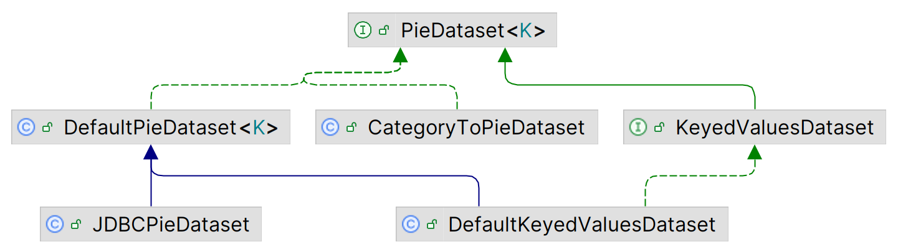
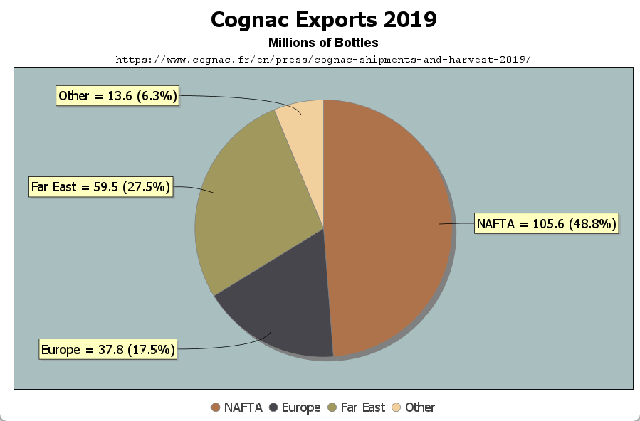
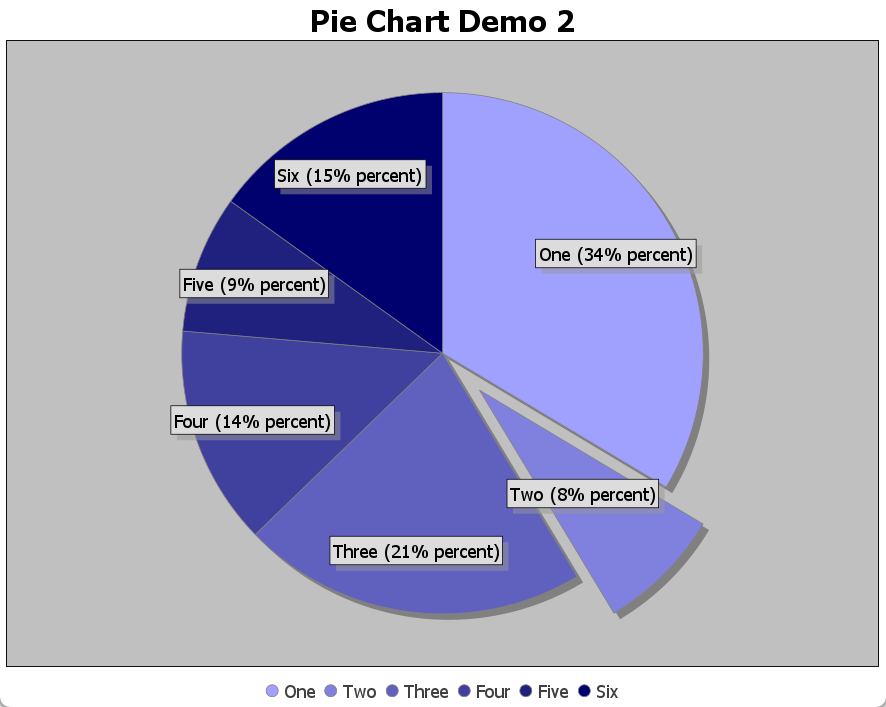

# Pie Chart

2025-06-17⭐
@author Jiawei Mao
***
## 简介

创建饼图分三步：

1. 创建数据集 `PieDataset`
2. 使用数据集创建 `JFreeChart`
3. 使用 `ChartPanel` 显示

### 1. 创建数据

`PieDataset` 的类图如下所示：

- `PieDataset` 扩展 `KeyedValues` 接口，主要特点是每个值有一个 unique key
- `PieDataset` 的泛型类型为 key 的类型
- 默认实现为 `DefaultPieDataset`



示例：创建 `PieDataset`

```java
DefaultPieDataset<String> dataset = new DefaultPieDataset<>();
dataset.setValue("NAFTA", 105.6);
dataset.setValue("Europe", 37.8);
dataset.setValue("Far East", 59.5);
dataset.setValue("Other", 13.6);
```

### 2. 创建 JFreeChart

```java
JFreeChart chart = ChartFactory.createPieChart(
        "Cognac Exports 2019",  // chart title
        dataset            // data
);
chart.addSubtitle(new TextTitle("Millions of Bottles"));
chart.addSubtitle(new TextTitle("https://www.cognac.fr/en/press/cognac-shipments-and-harvest-2019/",
        new Font("Courier New", Font.PLAIN, 10)));

PiePlot<String> plot = (PiePlot) chart.getPlot();
plot.setBackgroundPaint(new Color(169, 191, 191));

plot.setSectionPaint("NAFTA", new Color(175, 115, 75));
plot.setSectionPaint("Europe", new Color(71, 70, 76));
plot.setSectionPaint("Far East", new Color(161, 152, 94));
plot.setSectionPaint("Other", new Color(241, 208, 158));

StandardPieSectionLabelGenerator standardPieSectionLabelGenerator =
        new StandardPieSectionLabelGenerator("{0} = {1} ({2})", new DecimalFormat("0.0"), new DecimalFormat("0.0%"));
plot.setLabelGenerator(standardPieSectionLabelGenerator);
```

### 3. 创建 ChartPanel

```java
JFreeChart chart = createChart(createDataset());
chart.setPadding(new RectangleInsets(4.0, 8.0, 2.0, 2.0));
ChartPanel panel = new ChartPanel(chart);
panel.setMouseWheelEnabled(true);
panel.setPreferredSize(new Dimension(600, 300));
```

完整示例可参考 [PieChartDemo1](../../src/main/java/note/jfreechart/piechart/PieChartDemo1.java)。



## 设置分区颜色

饼图使用 `PiePlot` 渲染，首先从 `JFreeChart` 获得 `PiePlot` 实例，然后调用 `PiePlot.setSectionPaint` 设置不同分区的颜色：

```java
PiePlot<String> plot = (PiePlot) chart.getPlot();

plot.setSectionPaint("NAFTA", new Color(175, 115, 75));
plot.setSectionPaint("Europe", new Color(71, 70, 76));
plot.setSectionPaint("Far East", new Color(161, 152, 94));
plot.setSectionPaint("Other", new Color(241, 208, 158));
```

## 饼图分解

饼图分解，是指将某个或多个扇形区域向外移动，远离饼图的中心，构成饼被切开的效果。

`PiePlot` 内部使用一个 `TreeMap` 保存不同扇形区域向外移动的百分比。

- 设置百分比

```java
public void setExplodePercent(K key, double percent)
```

- 获取百分比

```java
public double getExplodePercent(K key)
```

完整示例可以参考 [PieChartDemo2](../../src/main/java/note/jfreechart/piechart/PieChartDemo2.java)。


