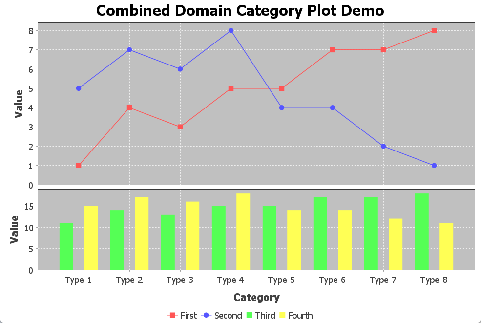
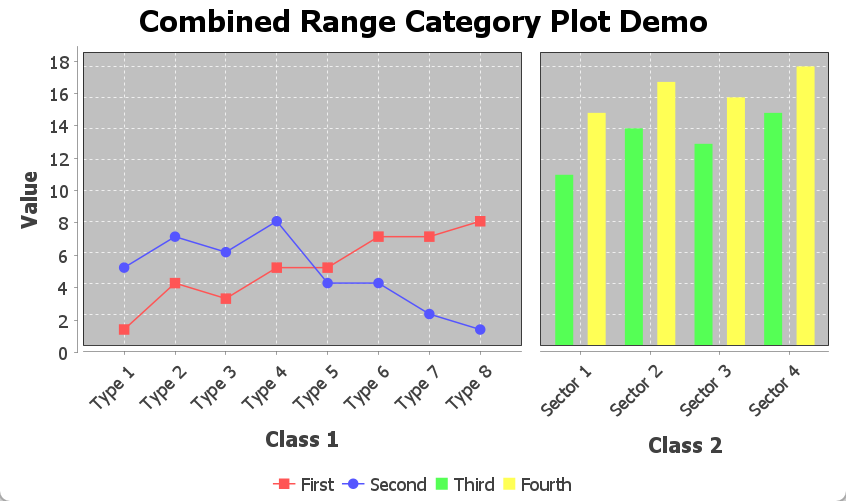
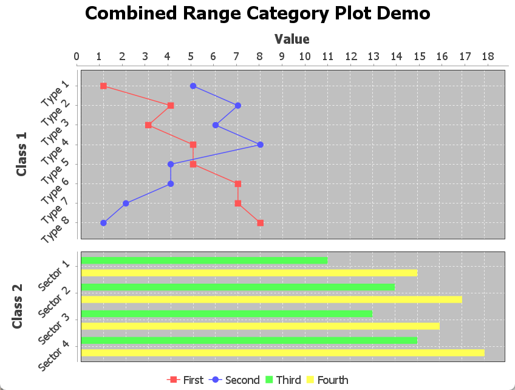
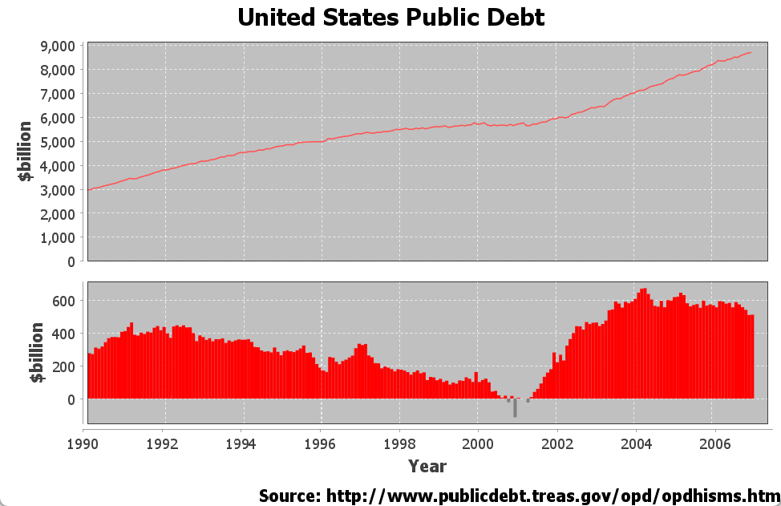
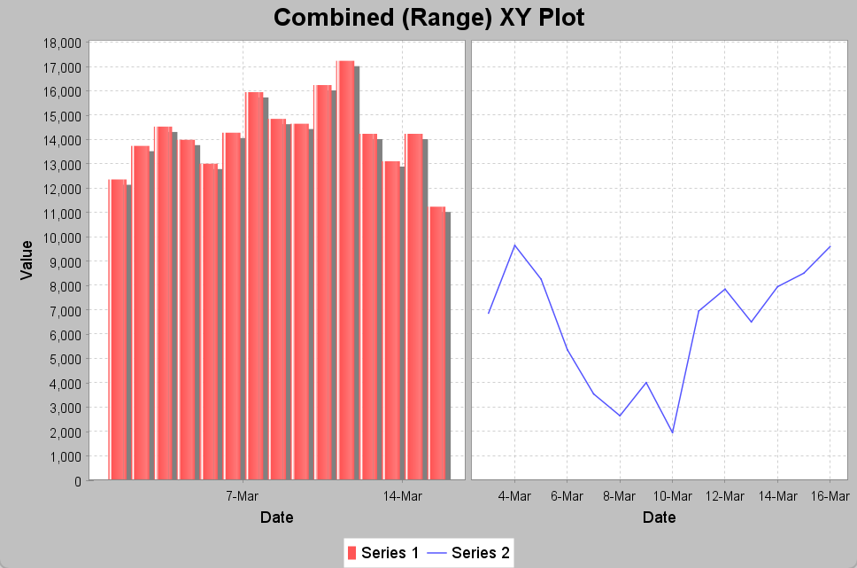

# 共享坐标轴

## 简介

JFreeChart 通过如下 `Plot` 类支持共享坐标轴：

- `CombinedDomainCategoryPlot` /` CombinedRangeCategoryPlot`
- `CombinedDomainXYPlot` / `CombinedRangeXYPlot`

## Domain CategoryPlot

显示两个或多个 `CategoryPlot`，这些 subplots 共享 domain-axis，各自独立拥有 range-axis。组合方式有水平和垂直两个方向。如下图所示：



完整代码可参考 [CombinedCategoryPlotDemo1](../../src/main/java/note/jfreechart/combinedaxis/CombinedCategoryPlotDemo1.java)。其中关键步骤是创建 `CombinedDomainCategoryPlot`：

```java
CategoryAxis domainAxis = new CategoryAxis("Category");
CombinedDomainCategoryPlot plot = new CombinedDomainCategoryPlot(domainAxis);
plot.add(subplot1, 2);
plot.add(subplot2, 1);

JFreeChart result = new JFreeChart(
        "Combined Domain Category Plot Demo",
        new Font("SansSerif", Font.BOLD, 12),
        plot,
        true
);
```

注意，`subplot1` 的权重为 2 (`add()` 方法的第二个参数)，而 `subplot2` 的权重为 1，权重控制分配给每个 plot 的**空间比例**。

添加的两个 subplots 就是常规的 `CategoryPlot`，它们的 domain-axis 已设置为 `null`。如下：

```java
CategoryDataset dataset1 = createDataset1();
NumberAxis rangeAxis1 = new NumberAxis("Value");
rangeAxis1.setStandardTickUnits(NumberAxis.createIntegerTickUnits());
LineAndShapeRenderer renderer1 = new LineAndShapeRenderer();
renderer1.setDefaultToolTipGenerator(new StandardCategoryToolTipGenerator());
CategoryPlot subplot1 = new CategoryPlot(dataset1, null, rangeAxis1, renderer1);
subplot1.setDomainGridlinesVisible(true);

CategoryDataset dataset2 = createDataset2();
NumberAxis rangeAxis2 = new NumberAxis("Value");
rangeAxis2.setStandardTickUnits(NumberAxis.createIntegerTickUnits());
BarRenderer renderer2 = new BarRenderer();
renderer2.setDefaultToolTipGenerator(new StandardCategoryToolTipGenerator());
CategoryPlot subplot2 = new CategoryPlot(dataset2, null, rangeAxis2, renderer2);
subplot2.setDomainGridlinesVisible(true);
```

## Range CategoryPlot

`CombinedRangeCategoryPlot` 显示两个或多个 `CategoryPlot`，它们共享 range-axis，每个 subplot 拥有各自的 domain-axis。也有水平和垂直组合两种方式。下图为垂直组合方式：



水平组合方式：



创建 `CombinedRangeCategoryPlot`：

```java
ValueAxis rangeAxis = new NumberAxis("Value");
CombinedRangeCategoryPlot plot = new CombinedRangeCategoryPlot(rangeAxis);
plot.add(subplot1, 3);
plot.add(subplot2, 2);
plot.setOrientation(PlotOrientation.HORIZONTAL);

JFreeChart result = new JFreeChart(
        "Combined Range Category Plot Demo",
        new Font("SansSerif", Font.BOLD, 12),
        plot,
        true
);
```

> [!NOTE]
>
> `add()` 方法的第二个参数为权重，用于设置 subplot 的相对空间大小。

subplots 都是常规的 `CategoryPlot`，它们的 range-axis 已经设置为 `null`。上图的示例代码：

```java
CategoryDataset dataset1 = createDataset1();
CategoryAxis domainAxis1 = new CategoryAxis("Class 1");
domainAxis1.setCategoryLabelPositions(CategoryLabelPositions.UP_45);
domainAxis1.setMaximumCategoryLabelWidthRatio(5.0f);
LineAndShapeRenderer renderer1 = new LineAndShapeRenderer();
renderer1.setDefaultToolTipGenerator(new StandardCategoryToolTipGenerator());
CategoryPlot subplot1 = new CategoryPlot(dataset1, domainAxis1, null, renderer1);
subplot1.setDomainGridlinesVisible(true);

CategoryDataset dataset2 = createDataset2();
CategoryAxis domainAxis2 = new CategoryAxis("Class 2");
domainAxis2.setCategoryLabelPositions(CategoryLabelPositions.UP_45);
domainAxis2.setMaximumCategoryLabelWidthRatio(5.0f);
BarRenderer renderer2 = new BarRenderer();
renderer2.setDefaultToolTipGenerator(new StandardCategoryToolTipGenerator());
CategoryPlot subplot2 = new CategoryPlot(dataset2, domainAxis2, null, renderer2);
subplot2.setDomainGridlinesVisible(true);
```

## Domain XY Plot

`CombinedDomainXYPlot` 显示两个或多个 subplots (`XYPlot` 实例)，共享 domain-axis。每个 subplot 各自维护独立的 range-axis。且有水平和垂直两种组合方式。

[CombinedXYPlotDemo1](../../src/main/java/note/jfreechart/combinedaxis/CombinedXYPlotDemo1.java) 包含下图所示：



关键步骤是创建 `CombinedDomainXYPlot`，添加 subplots：

```java
CombinedDomainXYPlot cplot = new CombinedDomainXYPlot(domainAxis);
cplot.add(plot1, 3);
cplot.add(plot2, 2);
cplot.setGap(8.0);
cplot.setDomainGridlinePaint(Color.WHITE);
cplot.setDomainGridlinesVisible(true);

// return a new chart containing the overlaid plot...
JFreeChart chart = new JFreeChart("United States Public Debt",
        JFreeChart.DEFAULT_TITLE_FONT, cplot, false);
```

`add()` 方法的第二个参数依然是权重，设置 subplot 占用的相对空间大小。

subplots 为 `XYPlot` 类型，domain-axis 设置为 `null`：

```java
IntervalXYDataset data1 = createDataset1();
XYItemRenderer renderer1 = new XYLineAndShapeRenderer(true, false);
renderer1.setDefaultToolTipGenerator(new StandardXYToolTipGenerator(
        StandardXYToolTipGenerator.DEFAULT_TOOL_TIP_FORMAT,
        new SimpleDateFormat("d-MMM-yyyy"), new DecimalFormat("0.00")));
renderer1.setSeriesStroke(0, new BasicStroke(4.0f,
        BasicStroke.CAP_ROUND, BasicStroke.JOIN_BEVEL));
renderer1.setSeriesPaint(0, Color.BLUE);

ValueAxis rangeAxis = new NumberAxis("$billion");
XYPlot subplot1 = new XYPlot(data1, null, rangeAxis, renderer1);

IntervalXYDataset data2 = createDataset2();
XYBarRenderer renderer2 = new XYBarRenderer() {
    public Paint getItemPaint(int series, int item) {
        XYDataset dataset = getPlot().getDataset();
        if (dataset.getYValue(series, item) >= 0.0)
            return Color.RED;
        return Color.GRAY;
    }
};
renderer2.setSeriesPaint(0, Color.RED);
renderer2.setDrawBarOutline(false);
renderer2.setDefaultToolTipGenerator(new StandardXYToolTipGenerator(
        StandardXYToolTipGenerator.DEFAULT_TOOL_TIP_FORMAT,
        new SimpleDateFormat("d-MMM-yyyy"), new DecimalFormat("0.00")));
renderer2.setBarPainter(new StandardXYBarPainter());
renderer2.setShadowVisible(false);

XYPlot subplot2 = new XYPlot(data2, null, new NumberAxis("$billion"), renderer2);
```

## Range XY Plot

`CombinedRangeXYPlot` 显示两个或多个 subplots (`XYPlot` 类型)，共享 range-axis。每个 subplot 各自维护 domain-axis。如下图所示：



[CombinedXYPlotDemo2](../../src/main/java/note/jfreechart/combinedaxis/CombinedXYPlotDemo2.java) 包含完整代码。其中关键步骤是创建 `CombinedRangeXYPlot` 并添加 subplots：

```java
CombinedRangeXYPlot plot = new CombinedRangeXYPlot(sharedAxis);
plot.add(subplot1, 1);
plot.add(subplot2, 1);

// return a new chart containing the overlaid plot...
return new JFreeChart("Combined (Range) XY Plot",
        JFreeChart.DEFAULT_TITLE_FONT, plot, true);
```

`add()` 第二个参数为对应 subplot 占据的相对空间权重。

subplots 都是常规 `XYPlot` 类型，它们 range-axis 设置为 `null`。例如：

```java
// create subplot 1...
IntervalXYDataset data1 = createDataset1();
XYBarRenderer renderer1 = new XYBarRenderer(0.20);
renderer1.setDefaultToolTipGenerator(new StandardXYToolTipGenerator(
        StandardXYToolTipGenerator.DEFAULT_TOOL_TIP_FORMAT,
        new SimpleDateFormat("d-MMM-yyyy"),
        new DecimalFormat("0,000.0")));
XYPlot subplot1 = new XYPlot(data1, new DateAxis("Date"), null, renderer1);

// create subplot 2...
XYDataset data2 = createDataset2();
StandardXYItemRenderer renderer2 = new StandardXYItemRenderer();
renderer2.setDefaultToolTipGenerator(new StandardXYToolTipGenerator(
        StandardXYToolTipGenerator.DEFAULT_TOOL_TIP_FORMAT,
        new SimpleDateFormat("d-MMM-yyyy"),
        new DecimalFormat("0,000.0")));
XYPlot subplot2 = new XYPlot(data2, new DateAxis("Date"), null, renderer2);
```


