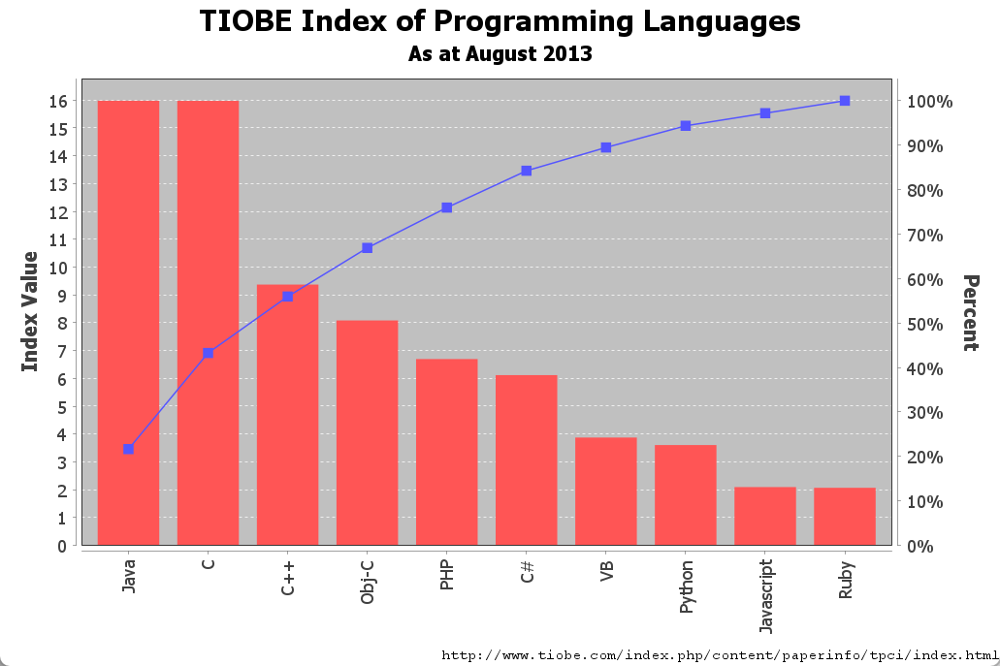

# 共享坐标轴

## 简介

JFreeChart 通过如下 `Plot` 类支持共享坐标轴：

- `CombinedDomainCategoryPlot` /` CombinedRangeCategoryPlot`
- `CombinedDomainXYPlot` / `CombinedRangeXYPlot`

## Category Domain Plot

显示两个或多个 `CategoryPlot`，这些 subplots 共享 domain-axis，各自独立拥有 range-axis。

组合方式有水平和垂直两个方向。

## 共享 x 轴-重叠

## 共享

