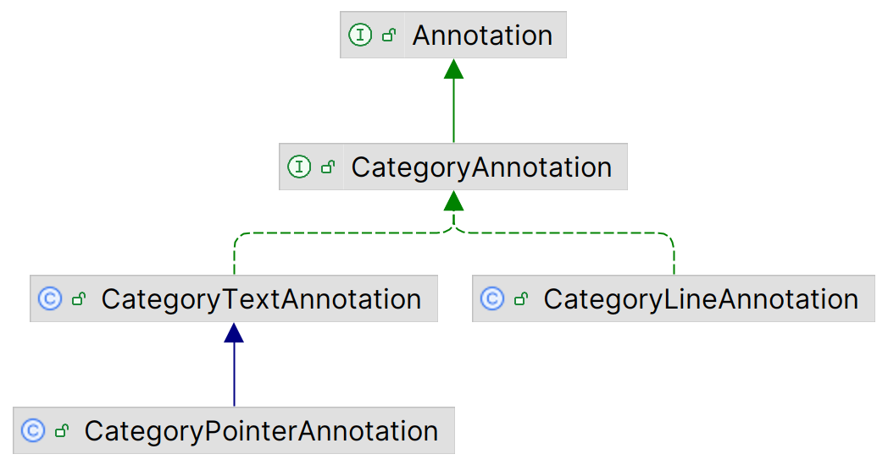
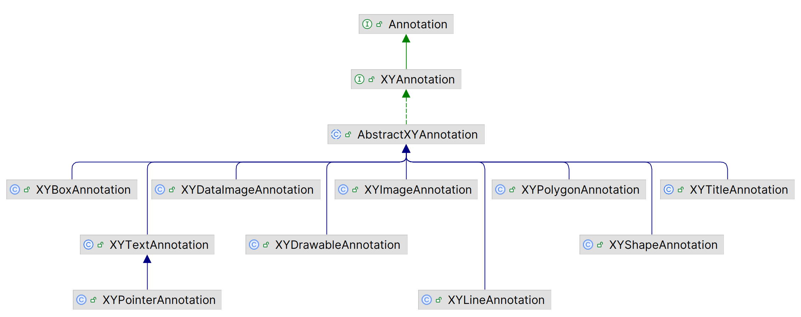

# 注释

## 简介

所有的注释类都实现 `Annotation` 接口，按照应用数据可以分为两类：

- `CategoryAnnotation`，用于 `CategoryPlot` 注释
- `XYAnnotation`，用于 `XYPlot` 注释

分类注释的类图如下：



数值注释的类图如下：



| 类                     | 功能                         |
| ---------------------- | ---------------------------- |
| `XYBoxAnnotation`      | 在指定数据坐标处绘制一个框   |
| `XYDrawableAnnotation` | 绘制一个 `Drawable` 实例     |
| `XYImageAnnotation`    | 绘制一个 image               |
| `XYLineAnnotation`     | 在指定的数据坐标之间画一条线 |
| `XYPointerAnnotation`  | 绘制文本和指向数据点的箭头   |
| `XYPolygonAnnotation`  | 绘制一个多边形               |
| `XYShapeAnnotation`    | 绘制任意 `Shape`             |
| `XYTextAnnotation`     | 绘制文本                     |

> [!TIP]
>
> 创建自定义注释，虽然不要求继承 `AbstractXYAnnotation`，但是继承它可以节省不少工作。

## XYAnnotation

`AbstractXYAnnotation` 添加了 tool-tip 文本和 URL：

- tool-tip，提示文本，当鼠标悬停在注释上，显示该文本
- URL，为 chart 创建 HTML image map 使用该 URL 提供超链接。

另外还有一个抽象方法 `draw` 用于执行渲染工作，子类需要实现该方法。

> [!TIP]
>
> 注释没有事件通知机制，因此在更新注释后，chart 不会自动更新。如果在 `ChartPanel` 中显示 chart，可以调用 `chart.setNotify(true)` 以更新。

### XYTextAnnotation

`XYTextAnnotation` 可能是最可能用到的注释类。该类只有一个构造函数：

```java
XYTextAnnotation(String text, double x, double y)
```

`text` 为注释文本，`x` 和 `y` 为文本位置。坐标值为坐标

## CategoryAnnotation

