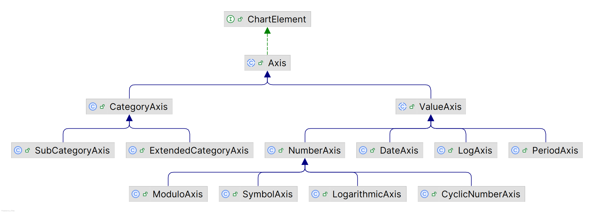

# 坐标轴

2025-01-15 ⭐
@author Jiawei Mao
***

## 简介

使用 `JFreeChart` 创建的大多数图表有两个轴：

- 定义域（domain axis）
- 值域（value axis）

当然，有些图表没有坐标轴，如 `PieChart`。对有坐标轴的图表，坐标轴由 `Axis` 对象表示。

坐标轴的类图如下，主要分为：

- 数值坐标轴：`ValueAxis`
  - `PeriodAxis`，基于 `RegularTimePeriod` 显示日期的坐标轴
  - `ModuloAxis`，使用模数计算显示固定范围数值的轴
- 分类坐标轴：`CategoryAxis`




## 获得 Axis 引用

在修改坐标轴属性前，需先获得 `Axis` 对象。`CategoryPlot` 和 `XYPlot` 都包含 `getDomainAxis()` 和 `getRangeAxis()` 方法：

- 分类坐标轴为 `CategoryAxis` 类型
- 数值类型坐标轴为 `ValueAxis` 类型

```java
// get an axis reference...
CategoryPlot plot = chart.getCategoryPlot();
CategoryAxis domainAxis = plot.getDomainAxis();

// change axis properties...
domainAxis.setLabel("Categories");
domainAxis.setLabelFont(someFont);
```

有些属性是类型特有的，因此需要转换类型：

```java
XYPlot plot = chart.getXYPlot();
NumberAxis rangeAxis = (NumberAxis) plot.getRangeAxis();
rangeAxis.setAutoRange(false);
```

## 坐标轴标签

使用 `Axis` 的如下方法设置标签属性：

- `setLabel()` 设置轴标签，设置为 `null` 表示不要标签
- `setLabelFont()` 标签字体
- `setLabelPaint()` 标签颜色
- `setLabelInsets()` 标签四周空白区域

## 旋转轴标签

对垂直坐标轴，轴标签会自动旋转 90 °。如果需要标签水平绘制，可以改变标签角度：

```java
XYPlot plot = chart.getXYPlot();
ValueAxis axis = plot.getRangeAxis();
axis.setLabelAngle(Math.PI / 2.0);
```

这里使用弧度指定角度，`Math.PI` 对应 180° 。

## 隐藏刻度标签

```java
CategoryPlot plot = chart.getCategoryPlot();
ValueAxis axis = plot.getRangeAxis();
axis.setTickLabelsVisible(false);
```

对 `CategoryAxis`，`setTickLabelsVisible(false)` 会隐藏分类标签。

## 隐藏刻度线

```java
XYPlot plot = chart.getXYPlot();
Axis axis = plot.getDomainAxis();
axis.setTickMarksVisible(false);
```

`CategoryAxis` 没有刻度线。

## 刻度大小

`NumberAxis` 和 `DateAxis` 会自动选择刻度大小，保证刻度标签不重叠:

- 通过 `setTickUnit()` 可以显式设置刻度单位。
- 可以自己指定一组刻度单位，坐标轴会从中自动选择可是的刻度大小

## 指定标准数字刻度单位

`NumberAxis` 的 `setStandardTickUnits()` 方法可以指定一组刻度单位，JFreeChart 会自动从中选择合适的单位。

例如，你有一个数字坐标轴。你只想显示整数刻度，`NumberAxis` 提供了一个静态方法返回一组标准整数刻度单位：

```java
XYPlot plot = chart.getXYPlot();
NumberAxis axis = (NumberAxis) plot.getRangeAxis();
TickUnitSource units = NumberAxis.createIntegerTickUnits();
axis.setStandardTickUnits(units);
```

如果希望更好地控制刻度单位，可以创建自己的 `TickUnits` 集合。

## 指定标准日期刻度单位

与标准数字刻度单位类似，`DateAxis` 也可以使用 `setStandardTickUnits()` 指定一组日期刻度单位。

`DateAxis` 的 `createStandardDateTickUnits()` 返回默认集合。

## CategoryAxis

- **categoryMargin**


## ValueAxis

- `standardTickUnits`

标轴刻度单位。设置方法：

```java
rangeAxis.setStandardTickUnits(NumberAxis.createIntegerTickUnits());
```


### NumberAxis

- `autoRangeIncludesZero`

自动设置范围是否包含 0。

