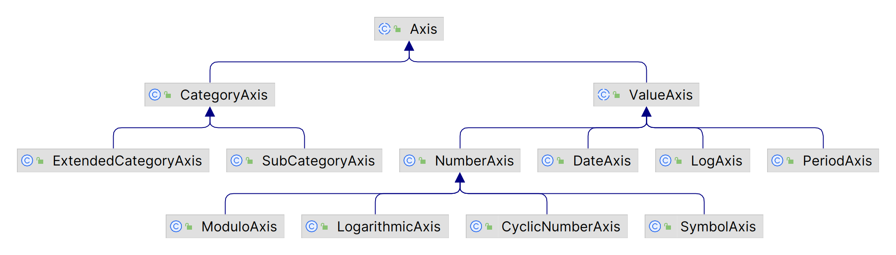

# 个性化图表

- [个性化图表](#个性化图表)
  - [Chart 属性](#chart-属性)
    - [Chart Border](#chart-border)
    - [Chart 背景色](#chart-背景色)
    - [Chart 背景图片](#chart-背景图片)
    - [渲染提示](#渲染提示)
  - [Plot 属性](#plot-属性)
    - [Plot 背景色](#plot-背景色)
    - [Plot 背景图片](#plot-背景图片)
  - [Axis 属性](#axis-属性)
    - [获得 Axis 引用](#获得-axis-引用)
    - [坐标轴标签](#坐标轴标签)
    - [旋转轴标签](#旋转轴标签)
    - [隐藏刻度标签](#隐藏刻度标签)
    - [隐藏刻度线](#隐藏刻度线)
    - [刻度大小](#刻度大小)
    - [指定标准数字刻度单位](#指定标准数字刻度单位)
    - [指定标准日期刻度单位](#指定标准日期刻度单位)

2023-12-26, 13:18⭐
***

## Chart 属性

通过 JFreeChart 类可以定制如下内容：

- chart border
- chart title and sub-titles
- background color and/or image
- rendering hints, 绘制图表的渲染提示，包括是否使用 anti-aliasing

### Chart Border

chart 的外边框：

- `setBorderVisible()`，设置边框可见，不可见
- `setBorderPaint()`，设置边框颜色
- `setBorderStroke()`，边框样式

如果在 `ChartPanel` 中显示图表，则用 Swing 提供的 border 工具更灵活。


### Chart 背景色

设置背景色：

```java
chart.setBackgroundPaint(Color.blue);
```

参数可以使用任何 Paint 接口实现，包括 `Color`, `GradientPaint` 和 `TexturePaint`：

```java
Paint p = new GradientPaint(0, 0, Color.white, 1000, 0, Color.green));
chart.setBackgroundPaint(p);
```

如果指定了背景图片，建议将背景色设为 `null`。

### Chart 背景图片

使用 setBackgroundImage() 设置背景图片：

```java
chart.setBackgroundImage(JFreeChart.INFO.getLogo());
```

默认缩放图像缩以填充 chart 区域，也可以使用` setBackgroundImageAlignment()` 修改默认行为：

```java
chart.setBackgroundImageAlignment(Align.TOP LEFT);
```

使用 `setBackgroundImageAlpha()` 可以设置背景图片的 alpha 透明度。

> 如果希望图像只填充数据区域（坐标轴内部区域），则需要向 `Plot` 添加背景图片。

### 渲染提示

`JFreeChart` 使用 Java2D API 绘制图表。在该 API 中，可以指定渲染提示来设置渲染引擎。

`JFreeChart` 通过 `setRenderingHints()` 方法设置渲染提示。

另有一个开启或关闭 anti-aliasing 的便捷方法：

```java
// turn on antialiasing...
chart.setAntiAlias(true);
```

## Plot 属性

JFreeChart 类将大部分的绘制工作交给 Plot 完成。JFreeChart.getPlot() 返回引用：

```java
Plot plot = chart.getPlot();
```

大多时候，需要将其转换为特定子类：

```java
CategoryPlot plot = chart.getCategoryPlot();
```

或：

```java
XYPlot plot = chart.getXYPlot();
```

`Plot` 有近 20 个子类，每种对应一个图表 类型。

### Plot 背景色

```java
Plot plot = chart.getPlot();
plot.setBackgroundPaint(Color.white);
```

plot 背景色也支持 `Color`, `GradientPaint`, `TexturePaint` 类型，或这是为 `null`。

### Plot 背景图片

```java
Plot plot = chart.getPlot();
plot.setBackgroundImage(JFreeChart.INFO.getLogo());
```

背景图片默认缩放以填充 plot 区域。

也可以设置图片的对齐方式：

```java
plot.setBackgroundImageAlignment(Align.BOTTOM RIGHT);
```

设置图片的透明度：

```java
setBackgroundAlpha()
```

## Axis 属性

使用 JFreeChart 创建的大多数图表有两个轴：

- 定义域（domain axis）
- 值域（value axis）

当然，有些图表没有坐标轴，如 `PieChart`。对有坐标轴的图表，坐标轴由 `Axis` 对象表示。

`Axis` 类型类图：



### 获得 Axis 引用

在修改坐标轴属性前，需先获得 `Axis` 对象。`CategoryPlot` 和 `XYPlot` 都包含 `getDomainAxis()` 和 `getRangeAxis()` 方法：

- 分类坐标轴为 `CategoryAxis` 类型
- 数值类型坐标轴为 `ValueAxis` 类型

```java
// get an axis reference...
CategoryPlot plot = chart.getCategoryPlot();
CategoryAxis domainAxis = plot.getDomainAxis();

// change axis properties...
domainAxis.setLabel("Categories");
domainAxis.setLabelFont(someFont);
```

有些属性是类型特有的，因此需要转换类型：

```java
XYPlot plot = chart.getXYPlot();
NumberAxis rangeAxis = (NumberAxis) plot.getRangeAxis();
rangeAxis.setAutoRange(false);
```

### 坐标轴标签

使用 `Axis` 的如下方法设置标签属性：

- `setLabel()` 设置轴标签，设置为 `null` 表示不要标签
- `setLabelFont()` 标签字体
- `setLabelPaint()` 标签颜色
- `setLabelInsets()` 标签四周空白区域

### 旋转轴标签

对垂直坐标轴，轴标签会自动旋转 90 °。如果需要标签水平绘制，可以改变标签角度：

```java
XYPlot plot = chart.getXYPlot();
ValueAxis axis = plot.getRangeAxis();
axis.setLabelAngle(Math.PI / 2.0);
```

这里使用弧度指定角度，`Math.PI` 对应 180° 。

### 隐藏刻度标签

```java
CategoryPlot plot = chart.getCategoryPlot();
ValueAxis axis = plot.getRangeAxis();
axis.setTickLabelsVisible(false);
```

对 `CategoryAxis`，`setTickLabelsVisible(false)` 会隐藏分类标签。

### 隐藏刻度线

```java
XYPlot plot = chart.getXYPlot();
Axis axis = plot.getDomainAxis();
axis.setTickMarksVisible(false);
```

`CategoryAxis` 没有刻度线。

### 刻度大小

`NumberAxis` 和 `DateAxis` 会自动选择刻度大小，保证刻度标签不重叠:

- 通过 `setTickUnit()` 可以显式设置刻度单位。
- 可以自己指定一组刻度单位，坐标轴会从中自动选择可是的刻度大小

### 指定标准数字刻度单位

`NumberAxis` 的 `setStandardTickUnits()` 方法可以指定一组刻度单位，JFreeChart 会自动从中选择合适的单位。

例如，你有一个数字坐标轴。你只想显示整数刻度，`NumberAxis` 提供了一个静态方法返回一组标准整数刻度单位：

```java
XYPlot plot = chart.getXYPlot();
NumberAxis axis = (NumberAxis) plot.getRangeAxis();
TickUnitSource units = NumberAxis.createIntegerTickUnits();
axis.setStandardTickUnits(units);
```

如果希望更好地控制刻度单位，可以创建自己的 `TickUnits` 集合。

### 指定标准日期刻度单位

与标准数字刻度单位类似，`DateAxis` 也可以使用 `setStandardTickUnits()` 指定一组日期刻度单位。

`DateAxis` 的 `createStandardDateTickUnits()` 返回默认集合。

