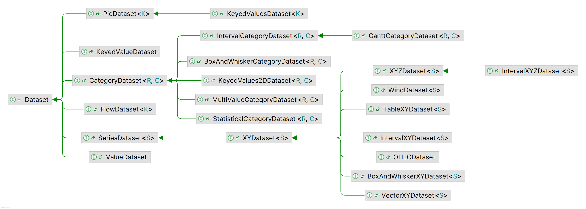
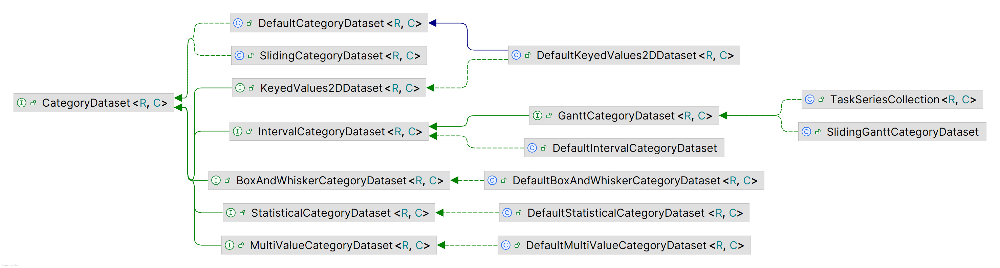
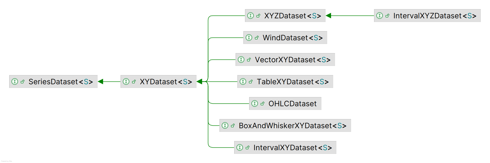

# 数据集

## 简介

`Dataset` 接口表示数据集。相关接口如下所示：



`Dataset` 主要有两种类型：

- `CategoryDataset`：用于分类变量数据集
- `SeriesDataset`：表示包含多组数据的数据集

余下数据集类型：

- `PieDataset`：为 PieChart 提供数据集
- `KeyedValueDataset`：只包含一个值的数据集
- `FlowDataset`：定义从 source nodes 到 target nodes 流动的数据集
- `ValueDataset`：包含一个值的数据集

包含 `XYDataset` 接口，扩展和实现类。为 `XYPlot` 对应 `XYItemRenderer` 提供数据。

## CategoryDataset

`CategoryDataset` 用于分类变量数据集，在 `Dataset` 的基础上为每个值添加了 `rowKey` 和 `columnKey`，可以通过索引和 key 来检索值。即扩展了 `KeyedValues2D` 接口：

```java
public interface KeyedValues2D<R extends Comparable<R>, C extends Comparable<C>> 
        extends Values2D {

    R getRowKey(int row);
    int getRowIndex(R key);
    List<R> getRowKeys();


    C getColumnKey(int column);
    int getColumnIndex(C key);
    List<C> getColumnKeys();

    Number getValue(R rowKey, C columnKey);
}
```



- `DefaultCategoryDataset` 提供了 `CategoryDataset` 的默认实现
- `SlidingCategoryDataset` 对 `CategoryDataset` 取子集
- `KeyedValues2DDataset` 与 `CategoryDataset` 等价
  - `DefaultKeyedValues2DDataset` 与 `DefaultCategoryDataset` 等价
- `IntervalCategoryDataset` 为每组数据定义范围
  - `DefaultIntervalCategoryDataset` 为 `IntervalCategoryDataset` 的默认实现
  - `GanttCategoryDataset` 在 `IntervalCategoryDataset` 的基础上增加了多个子区间
    - `SlidingGanttCategoryDataset` 对 `GanttCategoryDataset` 取子集操作
    - `TaskSeriesCollection` 为 `GanttCategoryDataset` 的默认实现
- `BoxAndWhiskerCategoryDataset` 为每个值添加了中位数、异常值和平均值
- `StatisticalCategoryDataset` 为每个值添加了平均值和标准偏差
- `MultiValueCategoryDataset` 每个 row-column key 对应多个值

## SeriesDataset

`SeriesDataset` 表示一个数据集包含多组数据，类图如下：



- `XYDataset` 表示 (x,y) 形式的数据，使用最广泛
- `XYZDataset` 表示 (x,y,z) 形式的数据
  - `IntervalXYZDataset` 在 `XYZDataset` 的基础上为每个点添加了数据范围
- `WindDataset` 为每个点添加了峰强度和风向
- `VectorXYDataset` 支持在每个数据点定义向量
- `TableXYDataset` 包含多组数据，每组数据共享 x 值，主要由 `StackedXYAreaRenderer` 使用定义堆叠面积图
- `OHLCDataset` 定义 (x, high, low, open, close) 形式的数据
- `BoxAndWhiskerXYDataset` 定义 (x, max, min, average, median) 形式的数据
- `IntervalXYDataset` 在 `XYDataset` 的基础上为每个点添加数据范围

## IntervalXYDataset

常用实现：

- `DefaultIntervalXYDataset`
- `XYIntervalSeriesCollection`

专用实现：

- `HistogramDataset`
- `SimpleHistogramDataset`
- `TimePeriodValuesCollection`
- `TimeSeriesCollection`
- `TimeTableXYDataset`
- `XYBarDataset`

