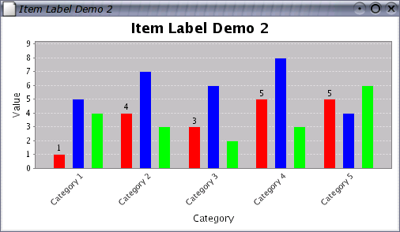

# 数据标签

2024-01-15⭐
***
## 简介

对许多图表类型，JFreeChart 可以在数据附近显示数据标签。例如，在条形图中标注数值：


下面介绍：

- 如何使标签可见
- 如何修改标签的外观（字体和颜色）
- 如何指定标签位置
- 自定义标签文本

建议少用该功能。图表应该是对数据的总结，如果需要在图标中显示实际的数据，那么用表格呈现可能更好。

**数据标签限制：** 

- 部分 renderer 不支持数据标签
- 坐标轴范围不会根据标签自动调整范围，如果没有设置足够 margin (`setUpperMargin()` 和 `setLowerMargin()`)，部分标签可能不可见。

## 显示标签

数据标签默认不可见，需要设置 renderer 来创建和显示它们。包括两步：

- 为 renderer 设置 `CategoryItemLabelGenerator` 或 `XYItemLabelGenerator`，这两对象负责创建标签
- 在 renderer 中设置标签可见，可以设置所有 series，也可以是某个 series

### 设置 ItemLabelGenerator

item-label 由分配给 renderer 的 label-generator 生成（tooltip 使用相同机制）。

- 为 `CategoryItemRenderer` 分配 label-generator

```java
CategoryItemRenderer renderer = plot.getRenderer();
CategoryItemLabelGenerator generator = new StandardCategoryItemLabelGenerator(
	"{2}", new DecimalFormat("0.00"));
renderer.setLabelGenerator(generator);
```

- 为 `XYItemRenderer` 分配 label-generator

```java
XYItemRenderer renderer = plot.getRenderer();
XYItemLabelGenerator generator = new StandardXYItemLabelGenerator(
	"{2}", new DecimalFormat("0.00"));
renderer.setLabelGenerator(generator);
```

在构造函数中可以定制 label-generator 的行为，或者自定义 label-generator.

### 使所有 Series 的 label 可见

使用 renderer 的 `setItemLabelsVisible()` 方法设置标签可见。例如，对 `CategoryItemRenderer`：

```java
CategoryItemRenderer renderer = plot.getRenderer();
renderer.setItemLabelsVisible(true);
```

- `XYItemRenderer`

```java
XYItemRenderer renderer = plot.getRenderer();
renderer.setItemLabelsVisible(true);
```

### 使指定 Series 的 label 可见

只设置指定 series 的标签可见，例如，只显示第一个 series 的数据标签：



调用代码的方式类似：

```java
CategoryItemRenderer renderer = plot.getRenderer();
renderer.setItemLabelsVisible(null); // clears the ALL series flag
renderer.setSeriesItemLabelsVisible(0, true);
renderer.setSeriesItemLabelsVisible(1, false);
```

> [!NOTE]
>
> 以上是 jfreechart 1.0.13 版本的设置方式，在 2.0 中，已替换为：

```java
CategoryItemRenderer renderer = plot.getRenderer();
renderer.setDefaultItemLabelsVisible(false); // clears the ALL series flag
renderer.setSeriesItemLabelsVisible(0, true);
```

按照以上步骤，如果仍然无法看到数据标签，可以检查：

- renderer 是否已设置 label-generator
- 部分 renderer 不支持 label

## 标签样式

可以修改标签的字体和颜色。和其它 renderer 属性一样，可以对所有 series 设置默认样式，也可以分别为每个 series 设置。

### 修饰标签字体

- 修改默认字体
```java
CategoryItemRenderer renderer = plot.getRenderer();
renderer.setDefaultItemLabelFont(new Font("SansSerif", Font.PLAIN, 10));
```

- 修改单个 series 字体
```java
CategoryItemRenderer renderer = plot.getRenderer();

// add settings for individual series...
renderer.setSeriesItemLabelFont(0, new Font("SansSerif", Font.PLAIN, 10));
renderer.setSeriesItemLabelFont(1, new Font("SansSerif", Font.BOLD, 10))
```

### 修改标签颜色

- 修改标签默认颜色
```java
CategoryItemRenderer renderer = plot.getRenderer();
renderer.setDefaultItemLabelPaint(Color.red);
```

- 修改单个 series 标签颜色
```java
CategoryItemRenderer renderer = plot.getRenderer();

renderer.setSeriesItemLabelPaint(0, Color.red);
renderer.setSeriesItemLabelPaint(1, Color.blue);
```

## 标签位置

标签的位置由 4 个属性控制，这 4 个属性都在 `ItemLabelPosition` 类中。在 CategoryItemRenderer 中，可以分别正值和负值数据定义标签位置：

```java
void setDefaultPositiveItemLabelPosition(ItemLabelPosition position);
void setDefaultNegativeItemLabelPosition(ItemLabelPosition position);
```

这些属性对设置标签位置十分关键：

- item-label-anchor：确定数据标签的 base-location
- text-anchor：标签上与 base-location 对齐的点
- rotation-anchor：标签上的点，标签围绕该点旋转
- rotation-angle：标签旋转的角度

### ItemLabelAnchor

`ItemLabelAnchor` 指定被标记数据附近的一个点 $(x,y)$。在绘制标签时，标签与该点对齐。

### TextAnchor

`TextAnchor` 为标签上的一个点，该点需要与 `ItemLabelAnchor` 对齐。`TextAnchor` 为 enum 类型，包含 `TOP_LEFT`, `TOP_CENTER`, `TOP_RIGHT`, `CENTER` 等诸多选项。

通过示例 [DrawStringDemo](../../src/main/java/note/jfreechart/DrawStringDemo.java) 可以了解 `TextAnchor` 如何将标签与屏幕上的点对齐。

### Rotation Anchor

rotation-anchor 也是标签上的一个点，如果设置旋转，标签围绕该点旋转。[DrawStringDemo](../../src/main/java/note/jfreechart/DrawStringDemo.java) 也演示了该属性。

### Rotation Angle

rotation-angle 定义标签旋转角度，比较好理解。

## 自定义标签文本

使用 JFreeChart 自带的标签生成器，生成的标签文本不一定满足需求。如果想要完全控制标签文本，可以自定义实现 `CategoryItemLabelGenerator` 接口。

下面简要介绍如何实现自定义 `CategoryItemLabelGenerator`，并通过两个示例进行说明。

`CategoryItemLabelGenerator` 接口很简单：

```java
public interface CategoryItemLabelGenerator {
    String generateRowLabel(CategoryDataset dataset, int row);
    String generateColumnLabel(CategoryDataset dataset, int column);
    String generateLabel(CategoryDataset dataset, int row, int column);
}
```

renderer 在需要标签的地方，会调用 `generateLabel(CategoryDataset dataset, int row, int column)` 获得标签文本，其中 `row` 就是 series 索引，`column` 就是 category 索引。不过由于提供了 `CategoryDataset` 引用，所以在该方法可以访问整个数据集。

### 示例 1：高于阈值则显示标签

自定义 item-label-generator，只显示数值大于指定阈值的标签。[ItemLabelDemo1](../../src/main/java/note/jfreechart/ItemLabelDemo1.java)：


### 示例 2：显示百分比

在条形图中，数据标签包含数值和百分比。[ItemLabelDemo2](../../src/main/java/note/jfreechart/ItemLabelDemo2.java)：

