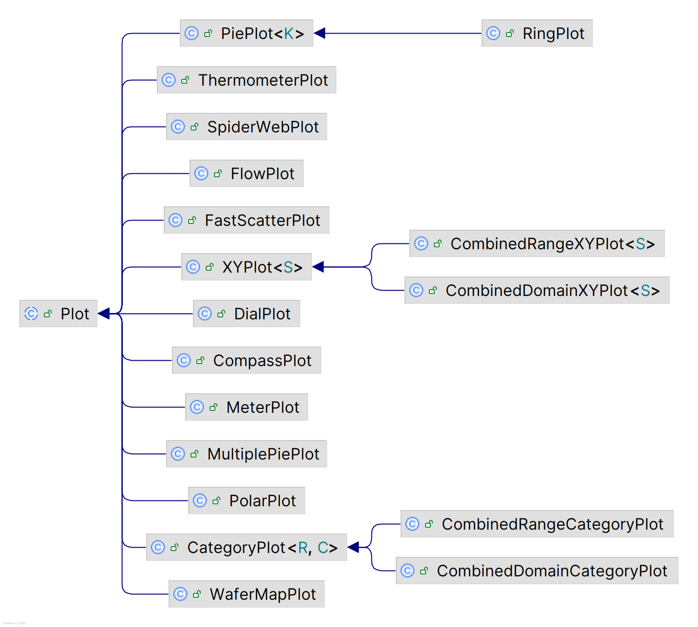
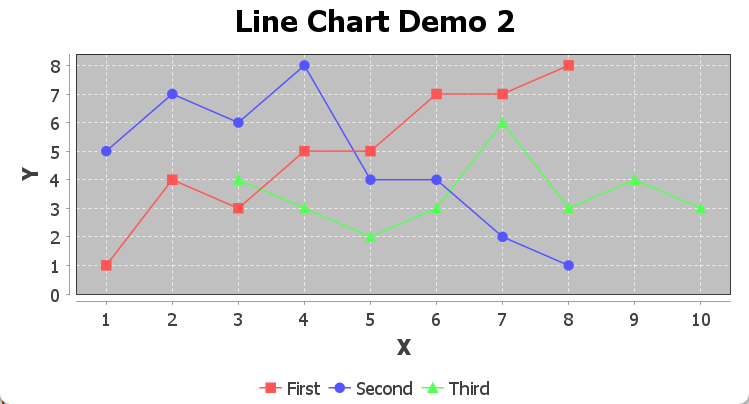
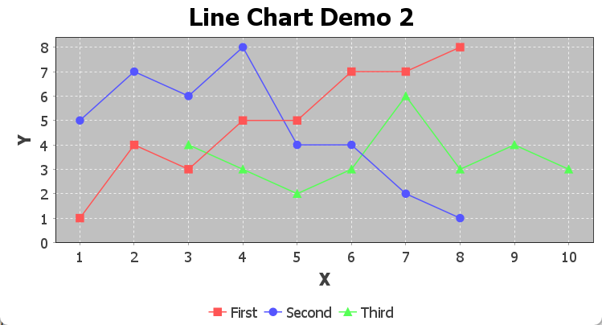

# Plot

- [Plot](#plot)
  - [简介](#简介)
  - [Plot 属性](#plot-属性)
    - [Plot 背景色](#plot-背景色)
    - [Plot 背景图片](#plot-背景图片)
  - [XYPlot](#xyplot)

2025-01-15
@author Jiawei Mao
***

## 简介

`JFreeChart` 类将大部分的绘制工作交给 `Plot` 完成。`JFreeChart.getPlot()` 返回引用：

```java
Plot plot = chart.getPlot();
```

大多时候，需要将其转换为特定子类：

```java
CategoryPlot plot = chart.getCategoryPlot();
```

或：

```java
XYPlot plot = chart.getXYPlot();
```

`Plot` 有近 20 个子类，每种对应一个图表类型。



## Plot 属性

### Plot 背景色

```java
Plot plot = chart.getPlot();
plot.setBackgroundPaint(Color.white);
```

plot 背景色也支持 `Color`, `GradientPaint`, `TexturePaint` 类型，或这是为 `null`。

### Plot 背景图片

```java
Plot plot = chart.getPlot();
plot.setBackgroundImage(JFreeChart.INFO.getLogo());
```

背景图片默认缩放以填充 plot 区域。

也可以设置图片的对齐方式：

```java
plot.setBackgroundImageAlignment(Align.BOTTOM RIGHT);
```

设置图片的透明度：

```java
setBackgroundAlpha()
```

## XYPlot

- `axisOffset`

数据区域和坐标轴之间的距离。例如 `plot.setAxisOffset(new RectangleInsets(5.0, 5.0, 5.0, 5.0));`。



设置为 0：`plot.setAxisOffset(new RectangleInsets(0.0, 0.0, 0.0, 0.0));`



- `domainGridlinePaint`

x 轴网格线颜色。

- `rangeGridlinePaint`

y 轴网格线颜色。
