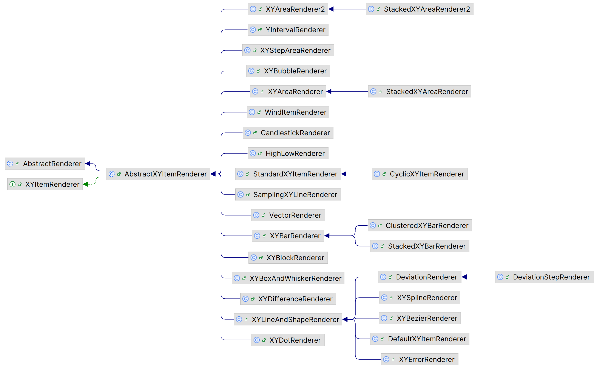

# Renderer

## 简介

包含用于 XYPlot 类渲染的 renderers。每种 render 对应一种 chart 类型。



## XYBarRenderer

适用数据集：`IntervalXYDataset`
图表类型： `XYPlot`

**构造函数**

- 创建 renderer，默认 margin 为 0.0

```java
public XYBarRenderer();
```

- 指定 margin 的 renderer，数值为百分比，如 0.10 表示 10 %

```java
public XYBarRenderer(double margin);
```

**一般属性**

- 设置 margin

margin 值为 bar 宽度的百分比。

```java
public double getMargin();
public void setMargin(double margin);
```

设置 margin 时，会同时向注册的 listeners 发送 `RendererChangeEvent`。


### XYBarPainter

renderer 有一个 `XYBarPainter` 对象，负责绘制单个 bar。JFreeChart 提供了两个实现：

- `StandardXYBarPainter`
- `GradientXYBarPainter`

## XYLineAndShapeRenderer

行为：

- 在每个点 (x, y) 之间绘制一条线
- 在每个点 (x, y) 绘制一个形状

可以对每个 series 可以设置：

- 数据点之间是否连接线
- 是否绘制每个点的形状
- 形状是否填充

该 renderer 

- `drawOutlines`

是否绘制 shape 的轮廓。

- `useFillPaint`

是否用 `fillPaint` 来填充 shape。如果不使用 `fillPaint`，则使用 `itemPaint`。

- `itemPaint`

```java
Paint getItemPaint(int row, int column
```

在绘制数据时的填充颜色。通常对整个 series 采用一个颜色。不过希望针对不同点采用不同颜色，可以覆盖该方法。

> [!WARNING]
>
> `XYLineAndShapeRenderer` 总是先渲染 line，然后渲染 shapes，该行为无法修改。

如果需要调整不同 series 的顺序，直接在 `XYLineAndShapeRenderer` 中无法修改，此时将每个 `Series` 单独作为一个数据集实现，然后设置不同数据集的渲染顺序：

```java
XYSeriesCollection dataset1 = new XYSeriesCollection(series1);
XYSeriesCollection dataset2 = new XYSeriesCollection(series2);

XYLineAndShapeRenderer renderer1 = new XYLineAndShapeRenderer(false, true);
XYLineAndShapeRenderer renderer2 = new XYLineAndShapeRenderer(true, false);

NumberAxis xAxis = new NumberAxis("");
xAxis.setAutoRangeIncludesZero(false);
NumberAxis yAxis = new NumberAxis("");

XYPlot plot = new XYPlot(dataset1, xAxis, yAxis, renderer1);
plot.setOrientation(PlotOrientation.VERTICAL);

plot.setDataset(1, dataset2);
plot.setRenderer(1, renderer2);

plot.setDatasetRenderingOrder(DatasetRenderingOrder.FORWARD);
```

