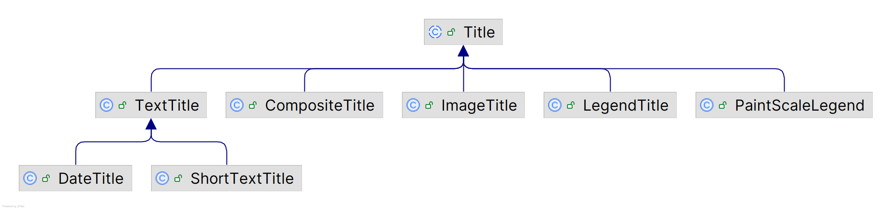

# 标题

## 简介

标题相关的类图如下：



每个 chart 有一个标题，可选位置包括：top, bottom, left, right。

标题类型为 `TextTitle`：

```java
TextTitle title = chart.getTitle();
```

修改标题文本：

```java
chart.setTitle("A Chart Title");
```

修改标题位置：

```java
chart.getTitle().setPosition(RectangleEdge.BOTTOM);
```

如果**不需要标题**，将其设置为 `null`。


## 副标题

Chart 可以有任意个副标题。副标题为类型为 `Title` 任意子类。添加副标题：

```java
TextTitle subtitle1 = new TextTitle("A Subtitle");
chart.addSubtitle(subtitle1);
```

要修改已有副标题，先获得引用：

```java
Title subtitle = chart.getSubtitle(0);
```

在修改副标题前，需要转换为对应类型。

`getSubtitleCount()` 返回副标题个数。

## Legend

在 jfreechart 中，图例是一个特殊的副标题，用 `LegendTitle` 类表示。

